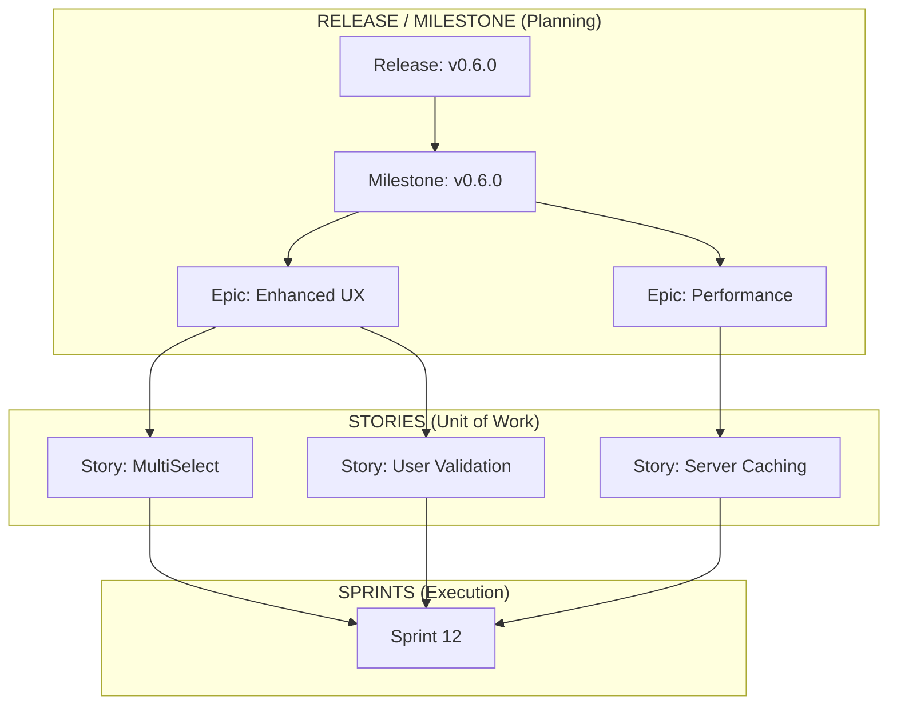

# AGENTS.md — gitpulse

This file provides shared context for all AI agents working on this project.
Read this before starting any task.

---

## Project Overview

gitpulse is a multi-client tool that reads git commit history and generates
AI-powered standup summaries. It has two clients — a CLI for local use and
a web interface for browser access — both sharing a common Python core library.

---

## Docs — Read Before Implementing

| Doc          | Path                            | When to read                    |
| ------------ | ------------------------------- | ------------------------------- |
| PRD v0.1     | `docs/prd/prd-v01.md`           | Before any CLI work             |
| PRD v0.2     | `docs/prd/prd-v02.md`           | Before any web UI work          |
| PRD v0.3     | `docs/prd/prd-v03.md`           | Before any v0.3 work            |
| Architecture | `docs/architecture/overview.md` | Before any implementation       |
| API Contract | `docs/api/api-contract.md`      | Before backend or frontend work |

---

## Project Management Strategy

GitPulse uses a structured hierarchy to bridge long-term vision with daily execution:



| Level | Name | Purpose |
| ----- | ---- | ------- |
| **1** | **Release** | Final customer version (e.g., `v0.6.0`). |
| **2** | **Milestone** | The GitHub container mapping 1:1 to a Release. |
| **3** | **Epic** | High-level feature area (e.g., "Analytics Dashboard"). |
| **4** | **Story** | Atomic requirement / Issue (e.g., "Fix button spacing"). |
| **5** | **Sprint** | The time-boxed window (1-2 weeks) for execution. |

---

---

## Codebase Structure

```none
gitpulse/
├── core/
│   ├── __init__.py
│   ├── repo_reader.py
│   ├── summarise.py
│   ├── utils.py
│   ├── tests/
│   │   ├── test_repo_reader.py
│   │   ├── test_summarise.py
│   │   └── test_utils.py
│   └── docs/
│       └── core-guide.md
├── cli/
│   ├── __init__.py
│   ├── cli.py
│   ├── tests/
│   │   └── test_cli.py
│   └── docs/
│       └── cli-guide.md
├── api/
│   ├── __init__.py
│   ├── api.py
│   ├── tests/
│   │   └── test_api.py
│   └── docs/
│       └── api-guide.md
├── web/
│   ├── src/
│   │   └── app/
│   │       └── page.tsx
│   ├── tests/
│   └── docs/
│       └── web-guide.md
├── docs/
│   ├── prd/
│   │   ├── prd-v01.md
│   │   ├── prd-v02.md
│   │   └── prd-v03.md
│   ├── architecture/
│   │   └── overview.md
│   ├── api/
│   │   └── api-contract.md
│   ├── decisions/
│   └── sphinx/
├── AGENTS.md
├── .antigravity/
│   ├── rules/
│   │   └── project-rules.md
│   └── skills/
│       ├── backend-dev/
│       │   └── SKILL.md
│       ├── frontend-dev/
│       │   └── SKILL.md
│       ├── reviewer/
│       │   └── SKILL.md
│       ├── tester-backend/
│       │   └── SKILL.md
│       └── tester-frontend/
│           └── SKILL.md
├── pyproject.toml
└── package.json
```

---

## Tech Stack

### Python (core + cli + api)

- Python 3.12+
- uv for package management
- FastAPI + uvicorn for API
- httpx for GitHub API calls
- GitPython for local git
- Groq API — llama-3.3-70b-versatile
- pytest for testing

### TypeScript (web)

- Next.js 14 App Router
- NextAuth.js (GitHub OAuth)
- TypeScript strict mode
- Tailwind CSS (with @tailwindcss/typography)
- shadcn/ui components
- fetch for API calls

---

## Coding Standards

### Python

- Google docstrings on all functions
- `logging` module — never `print`
- `%s` format style for logger calls: `logger.debug("msg: %s", var)`
- Type hints on all function signatures
- Guard clauses over nested ifs
- One function, one responsibility

### TypeScript

- Strict mode always
- No `any` types
- Interfaces over types for objects
- Named exports preferred

---

## Git Workflow

- Never commit directly to master — branch protection is enforced
- Branch naming: `feature/description`, `fix/description`, `test/description`
- Conventional commits always:
  - `feat:` new feature
  - `fix:` bug fix
  - `docs:` documentation
  - `refactor:` code change no feature/fix
  - `test:` adding tests
  - `chore:` build, config, tooling
- Every PR must reference an issue: `Closes #XX`
- Squash merge only

---

## Key Patterns

### repo_reader adapter pattern

```python
# CLI uses local source
get_commits(source="local", days=7)

# API uses github source
get_commits(source="github", username="deepusharma", repos=["gitpulse"], days=7)

# Both return same flat list shape:
# [{"repo": str, "message": str, "author": str, "date": datetime, "hash": str}]
```

### Import pattern

```python
# Always import from core — never from src
from core.repo_reader import get_commits
from core.summarise import format_commits, summarise
from core.utils import load_env
```

---

## Environment Variables

```YAML
GROQ_API_KEY=          # Required for all Python components
GITHUB_TOKEN=          # Optional — raises GitHub API rate limit
NEXT_PUBLIC_API_URL=   # Required for web — FastAPI backend URL
```

---

## Testing Rules

- Tests required for all new functions
- Mock all external API calls — Groq, GitHub API
- One test file per module
- Run tests before every PR: `pytest -v`
- CI runs automatically on every PR
- **Single Source of Truth**: All version changes MUST be applied atomically to the project hierarchy (Release > Milestone > Epic > Story) as defined in **[AGENTS.md](AGENTS.md#project-management-strategy)**. Version strings must be synced across:
  - `web/package.json`
  - `pyproject.toml`
  - `AGENTS.md` (Milestone History)
  - `docs/prd/PRD.md` (Release Table)

---

## Current Milestone

History:

- v0.1 ✅ Complete (Core CLI)
- v0.2 ✅ Complete (Web UI Initial)
- v0.3 ✅ Complete (UI Polish + OAuth)
- v0.4 ✅ Complete (Config + Packaging)
- v0.5 ✅ Complete (Analytics Dashboard)
- v0.6 ✅ Complete — Enhanced Input UX & Caching
- v0.7 🔵 Active — Packaging & DX

Active stories:

- #102 pip install gitpulse (Namespace Refactor)
- #103 PyPI publish workflow
- #104 gitpulse init (Typer)

Active branch: feature/sprint-09-packaging

---

## Sprint Workflow

- Sprint briefs: `docs/sprint/sprint-XX-brief.md` (Read to understand goal, constraints, and get the AI Planning Prompt)
- Sprint plans: `docs/sprint/sprint-XX-plan.md` (The step-by-step technical plan created during the planning session)
- Start with the brief, run the AI Planning Prompt to generate the plan, and wait for plan approval.
- Always read both the brief and the approved plan before starting execution.
- Save execution plan to file before closing planning chat.
- Open a new execution chat per sprint for clean context.

---

## Skills Available

Specialized agent skills are in `.antigravity/skills/`:

| Skill             | Use for                                                                       |
| ----------------- | ----------------------------------------------------------------------------- |
| `backend-dev`     | Python, FastAPI, core library work. Use @backend-dev for all core/ api/ work. |
| `frontend-dev`    | Next.js, TypeScript, Tailwind work. Use @frontend-dev for all web/ work.      |
| `reviewer`        | Code review and quality checks. Use @reviewer.                                |
| `tester-backend`  | pytest, Python test writing. Use @tester-backend for Python tests.            |
| `tester-frontend` | Vitest, React Testing Library. Use @tester-frontend for TypeScript tests.     |
