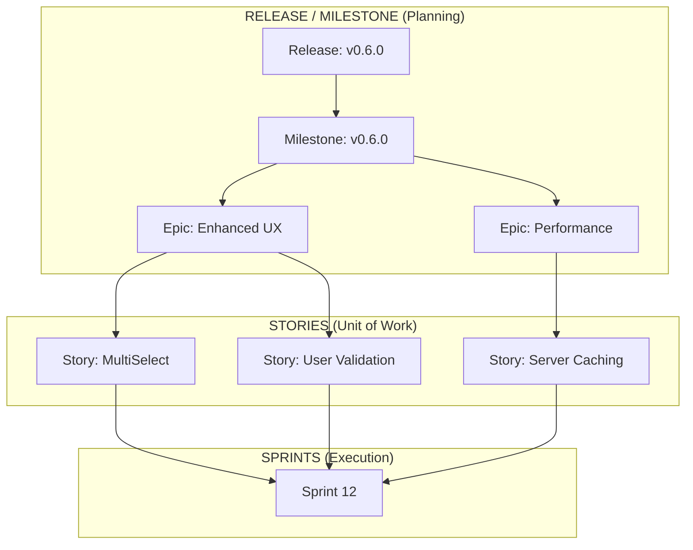

# AGENTS.md — gitpulse

This file provides guidance to AI coding agents (Claude Code, Gemini, etc.) when working with code in this repository. `CLAUDE.md` and `GEMINI.md` are 1-line pointers to this file — no content lives there.

---

## Project Overview

gitpulse is a multi-client tool that reads git commit history and generates
AI-powered standup summaries. It has two clients — a CLI for local use and
a web interface for browser access — both sharing a common Python core library.

---

## Tech Stack

### Python (core + cli + api)

- Python 3.12+
- uv for package management
- FastAPI + uvicorn for API
- httpx for GitHub API calls
- GitPython for local git
- Groq API — llama-3.3-70b-versatile
- pytest for testing

### TypeScript (web)

- Next.js 16 App Router (verified against `web/package.json` 2026-07-12 — if this drifts again, check `package.json`, don't guess)
- NextAuth.js (GitHub OAuth)
- TypeScript strict mode
- Tailwind CSS (with @tailwindcss/typography)
- shadcn/ui components
- fetch for API calls

---

## Dev Commands

### Python (core + cli + api)

```bash
uv sync --extra dev          # Install all deps including test extras

uv run pytest -v             # Run all tests
uv run pytest gitpulse/core/tests/test_repo_reader.py -v  # Single file
uv run pytest -k "test_name" # Single test by name

uv run gitpulse              # Run the CLI
uv run uvicorn api.api:app --reload  # Run the API server (dev)
uv run ruff check .          # Lint (blocks print statements via T20 rule)
```

### Web

```bash
cd web
npm run dev    # Dev server
npm run build  # Production build
npm run lint   # ESLint
npm run test   # Vitest unit tests
```

---

## Coding Standards

### Python

- **File size limit:** 300 lines max per file in `api/` and `gitpulse/core/`. Files approaching this limit must be split before adding new features.
- **Function size:** under 30 lines, single responsibility. Guard clauses over nested ifs.
- Google docstrings on all functions
- `logging` module — never `print`
- `%s` format style for logger calls: `logger.debug("msg: %s", var)`; always include `exc_info=True` on error-level logs
- Type hints on all function signatures
- No hardcoding — config (URLs, model names, API keys) comes from env vars or `~/.gitpulse.toml`, never inline
- Never put business logic in `cli.py` or `api.py` — always implement it in `gitpulse.core`

### TypeScript

- Strict mode always
- No `any` types
- Interfaces over types for objects — do not prefix interfaces with `I`
- Named exports preferred
- JSDoc on exported functions/components

### Naming

- **Python:** `snake_case` for functions/variables, `PascalCase` for classes, `UPPER_CASE` for constants.
- **TypeScript:** `camelCase` for functions/variables, `PascalCase` for components/interfaces.

### UI Standards

shadcn/ui + Tailwind CSS. Monochrome/neutral palette with a single accent color. Mobile-first responsive design.

---

## Git Workflow

- Never commit directly to master — branch protection is enforced
- Branch naming: `feature/description`, `fix/description`, `test/description`
- Conventional commits always:
  - `feat:` new feature
  - `fix:` bug fix
  - `docs:` documentation
  - `refactor:` code change no feature/fix
  - `test:` adding tests
  - `chore:` build, config, tooling
- Every PR must reference an issue: `Closes #XX`
- Squash merge only
- **PR Hygiene**: Mandatory audit of all open PRs before every squash merge. Close stale duplicates or superseded branches during the release process.

---

## Testing Rules

- Tests required for all new functions
- Mock all external API calls — Groq, GitHub API
- One test file per module
- Run tests before every PR: `pytest -v`
- CI runs automatically on every PR

---

## Project-Specific

### Docs — Read Before Implementing

| Doc          | Path                            | When to read                    |
| ------------ | ------------------------------- | ------------------------------- |
| PRD v0.1     | `docs/prd/archive/prd-v01.md`   | Before any CLI work             |
| PRD v0.2     | `docs/prd/archive/prd-v02.md`   | Before any web UI work          |
| PRD v0.3     | `docs/prd/archive/prd-v03.md`   | Before any v0.3 work            |
| Architecture | `docs/architecture/overview.md` | Before any implementation       |
| API Contract | `docs/api/api-contract.md`      | Before backend or frontend work |

### Project Management Strategy

GitPulse uses a structured hierarchy to bridge long-term vision with daily execution:


```mermaid
graph TD
    subgraph "RELEASE / MILESTONE (Planning)"
        R[Release: v0.6.0] --> M[Milestone: v0.6.0]
        M --> E1[Epic: Enhanced UX]
        M --> E2[Epic: Performance]
    end

    subgraph "STORIES (Unit of Work)"
        E1 --> S1[Story: MultiSelect]
        E1 --> S2[Story: User Validation]
        E2 --> S3[Story: Server Caching]
    end

    subgraph "SPRINTS (Execution)"
        S1 --> SP[Sprint 12]
        S2 --> SP
        S3 --> SP
    end
```

| Level | Name | Purpose |
| ----- | ---- | ------- |
| **1** | **Release** | Final customer version (e.g., `v0.6.0`). |
| **2** | **Milestone** | The GitHub container mapping 1:1 to a Release. |
| **3** | **Epic** | High-level feature area (e.g., "Analytics Dashboard"). |
| **4** | **Story** | Atomic requirement / Issue (e.g., "Fix button spacing"). |
| **5** | **Sprint** | The time-boxed window (1-2 weeks) for execution. |

**Single Source of Truth**: All version changes MUST be applied atomically to the project hierarchy (Release > Milestone > Epic > Story) as defined above. Version strings must be synced across:
- `web/package.json`
- `pyproject.toml`
- `AGENTS.md` (Milestone History, below)
- `docs/prd/PRD.md` (Release Table)

### Codebase Structure

```none
gitpulse/                    ← pip-installable package root
├── __init__.py
├── core/
│   ├── repo_reader.py
│   ├── summarise.py
│   ├── utils.py
│   ├── tests/
│   └── docs/
│       └── core-guide.md
├── cli/
│   ├── cli.py
│   ├── tests/
│   └── docs/
│       └── cli-guide.md
api/                         ← FastAPI server (root level, not in package)
├── api.py
├── cache.py
├── db.py
├── tests/
└── docs/
    └── api-guide.md         # TODO: not yet created
web/                         ← Next.js frontend
├── src/app/
├── tests/
└── docs/
    └── web-guide.md
docs/
├── prd/
│   ├── PRD.md
│   └── archive/             ← prd-v01.md, prd-v02.md, prd-v03.md
├── architecture/
│   └── overview.md
├── api/
│   └── api-contract.md
├── sprint/
└── decisions/
CLAUDE.md
.antigravity/
├── rules/project-rules.md
└── skills/
    ├── backend-dev/SKILL.md
    ├── frontend-dev/SKILL.md
    ├── reviewer/SKILL.md
    ├── tester-backend/SKILL.md
    └── tester-frontend/SKILL.md
pyproject.toml
```

### Key Patterns

**repo_reader adapter pattern**

```python
# CLI uses local source
get_commits(source="local", days=7)

# API uses github source
get_commits(source="github", username="deepusharma", repos=["gitpulse"], days=7)

# Both return same flat list shape:
# [{"repo": str, "message": str, "author": str, "date": datetime, "hash": str}]
```

**Import pattern**

```python
# Always import from gitpulse.core — never relative or from src
from gitpulse.core.repo_reader import get_commits
from gitpulse.core.summarise import format_commits, summarise
from gitpulse.core.utils import load_env
```

### Environment Variables

```YAML
GROQ_API_KEY=          # Required for all Python components
GITHUB_TOKEN=          # Optional — raises GitHub API rate limit
NEXT_PUBLIC_API_URL=   # Required for web — FastAPI backend URL
```

### Current Milestone

History:

- v0.1 ✅ Complete (Core CLI)
- v0.2 ✅ Complete (Web UI Initial)
- v0.3 ✅ Complete (UI Polish + OAuth)
- v0.4 ✅ Complete (Config + Packaging)
- v0.5 ✅ Complete (Analytics Dashboard)
- v0.6 ✅ Complete — Enhanced Input UX & Caching
- v0.7 ✅ Complete — Packaging & DX
- v0.8 ✅ Complete — Open Source Ready
- v0.9 ✅ Complete — Depth & Intelligence
- v1.0 ✅ Complete — Team & Reach
- v1.1 ✅ Complete — Pro Features
- v1.2 ✅ Complete — AI & MCP (Sprint 17)
- v1.3 ✅ Complete — Delight (Sprint 18, 20)
- v1.4 ✅ Complete — Code Health (Sprint 19)
- v1.5 ✅ Complete — Release Hardening (Sprint 23)
- v1.6 ✅ Complete — Observability & Growth (Sprint 24)


Active stories:

- Sprint 24: Observability & Growth — ✅ Done

Active:
- Awaiting v1.7 Brief & Planning

### Sprint Workflow

- Sprint briefs: `docs/sprint/sprint-XX-brief.md` (Read to understand goal, constraints, and get the AI Planning Prompt)
- Sprint plans: `docs/sprint/sprint-XX-plan.md` (The step-by-step technical plan created during the planning session)
- Start with the brief, run the AI Planning Prompt to generate the plan, and wait for plan approval.
- Always read both the brief and the approved plan before starting execution.
- Save execution plan to file before closing planning chat.
- Open a new execution chat per sprint for clean context.

### Skills Available

Specialized agent skills are in `.antigravity/skills/`:

| Skill             | Use for                                                                       |
| ----------------- | ----------------------------------------------------------------------------- |
| `backend-dev`     | Python, FastAPI, core library work. Use @backend-dev for all core/ api/ work. |
| `frontend-dev`    | Next.js, TypeScript, Tailwind work. Use @frontend-dev for all web/ work.      |
| `reviewer`        | Code review and quality checks. Use @reviewer.                                |
| `tester-backend`  | pytest, Python test writing. Use @tester-backend for Python tests.            |
| `tester-frontend` | Vitest, React Testing Library. Use @tester-frontend for TypeScript tests.     |

---

## Session Protocol

Naming prefix: `gitpulse`. No dedicated state file — the "Current Milestone" section above (under Project-Specific) already serves as the living state tracker; update it instead of adding a separate file.
