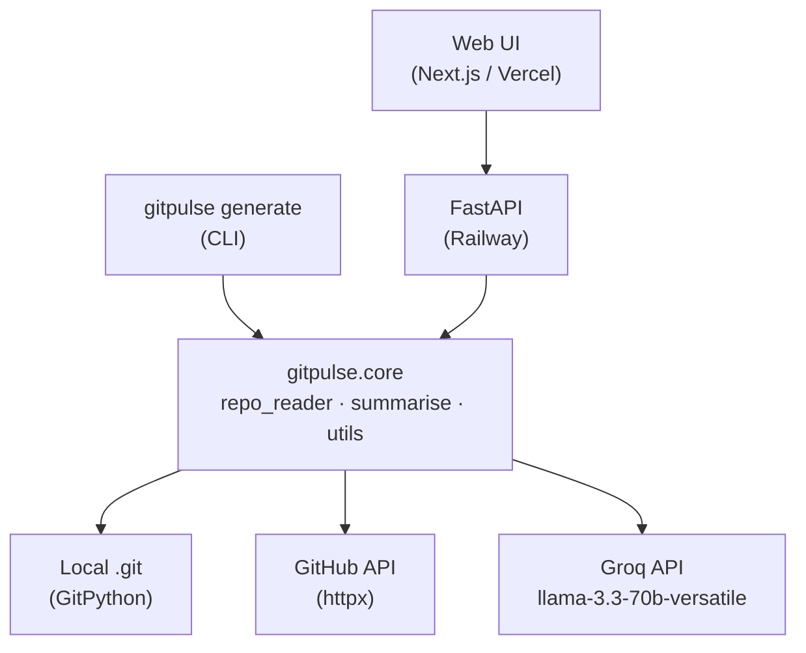

# gitpulse

> AI-powered standup summaries from your git history — in seconds.

[](https://github.com/deepusharma/gitpulse/actions/workflows/ci.yml)
[](https://pypi.org/project/gitpulse/)


**gitpulse** reads your local git history (or remote GitHub repos), and uses the Groq LLM to generate a structured, professional standup update — in the four-section format your team already uses.

---

## 🎬 Demo



---

## ✨ Features

- **CLI** — run `gitpulse generate` in any project directory; get a standup in seconds
- **Web UI** — log in with GitHub OAuth, select repos, generate without installing anything
- **Multi-repo** — combine commits across any number of repos into one summary
- **Config-driven** — set default repos, lookback window, and output path in `~/.gitpulse.toml`
- **History** — every summary is persisted; browse and search past standups at `/history`
- **Analytics** — commit frequency charts and repo activity breakdowns at `/dashboard`

---

## 🚀 Installation

### Via pip (recommended)

```bash
pip install gitpulse
```

### From source (for contributors)

```bash
git clone https://github.com/deepusharma/gitpulse.git
cd gitpulse
uv venv && source .venv/bin/activate
uv pip install -e ".[dev]"
```

---

## ⚡ Quick Start

```bash
# 1. Install
pip install gitpulse

# 2. Set your API key
export GROQ_API_KEY=gsk_...          # get one free at console.groq.com

# 3. Run interactive setup (creates ~/.gitpulse.toml)
gitpulse init

# 4. Generate your first standup
gitpulse generate
```

You'll get a standup summary in your terminal and saved to `output/summary.md`.

---

## ⚙️ Configuration — `~/.gitpulse.toml`

`gitpulse init` creates this file interactively. You can also edit it manually:

```toml
# ~/.gitpulse.toml
github_username = "deepusharma"

[defaults]
days   = 7
output = "output/summary.md"

[repos]
gitpulse = "/Users/you/projects/gitpulse"
my-app   = "/Users/you/projects/my-app"
```

**Full reference:**

| Key | Section | Type | Default | Description |
|---|---|---|---|---|
| `github_username` | root | string | — | Your GitHub username |
| `days` | `[defaults]` | int | `7` | Default lookback window in days |
| `output` | `[defaults]` | string | `"output/summary.md"` | Output file path |
| `<name>` | `[repos]` | string | — | Absolute path to a local git repository |

---

## 📖 CLI Reference

```bash
gitpulse init                          # Interactive setup wizard
gitpulse generate                      # Generate for all configured repos (last 7 days)
gitpulse generate --days 14            # Look back 14 days
gitpulse generate --repo my-app        # Specific repo only
gitpulse generate --output stand.md   # Custom output file
gitpulse generate --dry-run            # Show commits only; skip the LLM call
gitpulse generate --debug             # Verbose logging
```

Full CLI docs: https://deepusharma.github.io/gitpulse/cli-reference/

---

## 🌐 Web UI

Try it live — no install required:

| Component | URL |
|---|---|
| **Web UI** | https://gitpulse-kappa.vercel.app |
| **API** | https://web-production-83e65.up.railway.app |

1. Log in with **GitHub OAuth**
2. Enter your username → repos load automatically
3. Select repos, set lookback window, hit **Generate**
4. Download the result or browse **History**

> *Web UI screenshot coming soon*

---

## 🔌 API Quick Reference

Base URL: `https://web-production-83e65.up.railway.app`

| Method | Path | Description |
|---|---|---|
| `POST` | `/summarise` | Generate a standup summary |
| `GET` | `/history` | Retrieve past summaries |
| `GET` | `/analytics` | Commit activity data |
| `GET` | `/health` | Service health check |

**Example:**
```bash
curl -X POST https://web-production-83e65.up.railway.app/summarise \
  -H "Content-Type: application/json" \
  -d '{"username": "deepusharma", "repos": ["gitpulse"], "days": 7}'
```

Full API docs: https://deepusharma.github.io/gitpulse/api-reference/

---

## 🏗️ Architecture



---

## 🗂️ Project Structure

```
gitpulse/            ← pip-installable package
├── core/            # Shared library: repo reading & AI summarization
├── cli/             # Typer-based CLI tool
api/                 # FastAPI backend
web/                 # Next.js 14 frontend (App Router)
docs/                # PRDs, architecture, and sprint docs
```

---

## ✅ Run Tests

```bash
# Python
uv run pytest -v

# Frontend
cd web && npm run test
```

---

## 🚧 Troubleshooting

### `GROQ_API_KEY` invalid or missing
- **Error**: `Authentication Failed` Rich panel
- **Fix**: Set a valid key → `export GROQ_API_KEY=gsk_...` or add to `.env`
- **Get key**: https://console.groq.com

### GitHub API rate limits
- **Error**: `403 Forbidden` or `429 Too Many Requests`
- **Fix**: Add `GITHUB_TOKEN` to your `.env` file (raises limit from 60 → 5,000 req/hr)

### Config not found
- **Error**: `~/.gitpulse.toml not found`
- **Fix**: Run `gitpulse init`

---

## 🗺️ Roadmap

| Version | Theme | Status |
|---|---|---|
| v0.7 | Packaging & DX (`pip install`, `gitpulse init`) | ✅ Complete |
| v0.8 | Open Source Ready (README, MkDocs, release workflow) | 🔵 Active |
| v0.9 | Depth & Intelligence (PR/issue enrichment, `/insights`) | 📋 Planned |
| v1.0 | Team & Reach (team standup, badge generator) | 📋 Planned |

---

## 🤝 Contributing

Contributions are welcome! Please read [CONTRIBUTING.md](CONTRIBUTING.md) to get started.

- [Bug reports](.github/ISSUE_TEMPLATE/bug_report.md)
- [Feature requests](.github/ISSUE_TEMPLATE/feature_request.md)
- [Pull request template](.github/PULL_REQUEST_TEMPLATE.md)

- 
---

## 📚 Documentation

Full docs: **https://deepusharma.github.io/gitpulse**

---

## 📄 License

[MIT](LICENSE) — built with ❤️ using [Groq](https://groq.com), [FastAPI](https://fastapi.tiangolo.com), [Next.js](https://nextjs.org), and [uv](https://github.com/astral-sh/uv).
