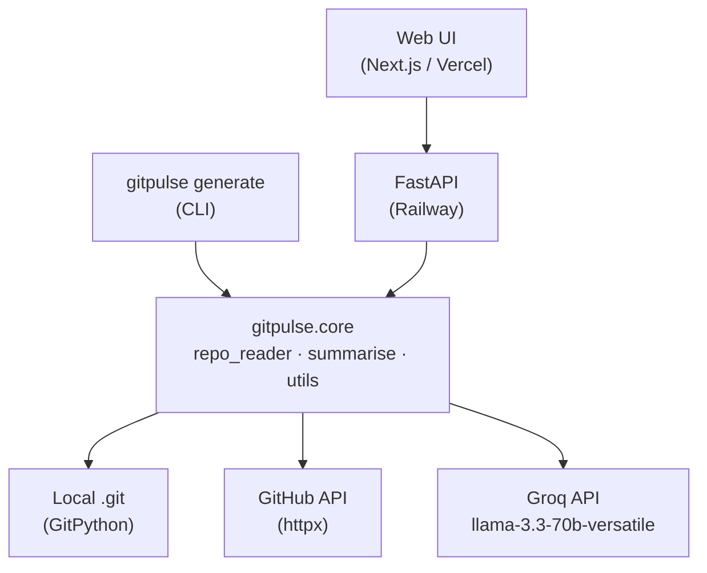

# Architecture

GitPulse is a multi-client tool traversing a shared Python core.

## Core Elements

- **`core/`**: Shared Python library holding all business logic (`repo_reader.py`, `summarise.py`). Adapter pattern abstracting local `.git` analysis and remote GitHub API fetching.
- **`cli/`**: Typer-based CLI interface pointing to `core/` functions mapped with local paths.
- **`api/`**: Asynchronous FastAPI endpoints executing `core/` functions processing GitHub data requests.
- **`web/`**: Next.js 14 frontend, fully decoupled, fetching JSON schemas strictly via `api/` endpoints.
